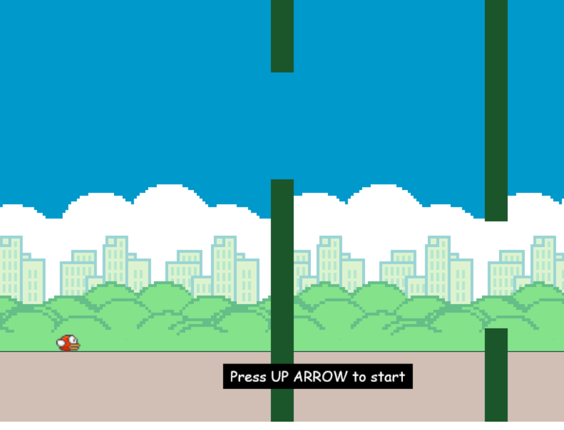

# Flappy Bird Clone

A simple Flappy Bird clone built with Phaser 3, featuring basic physics, collision detection, and obstacle avoidance gameplay.

<p align="center">
  
  <br>
  <em>Gameplay screenshot showing bird and columns</em>
</p>

## Features

- Classic Flappy Bird-style gameplay
- Physics-based movement with gravity
- Randomly generated obstacles (columns)
- Collision detection with ground and obstacles
- Win condition after passing all obstacles
- Responsive controls (keyboard only)
- Game state management (start, play, game over, win)

## Technologies Used

- [Phaser 3](https://phaser.io/) - HTML5 game framework
- JavaScript
- HTML5

## How to Play

1. Press the **UP ARROW** key to start the game
2. Keep pressing **UP ARROW** to make the bird fly upward
3. Navigate through the gaps between the columns
4. Avoid hitting the columns or the ground
5. Pass all three columns to win!

## Installation

To run the game locally:

1. Clone this repository:
   ```bash
   git clone https://github.com/your-username/flappy-bird-clone.git
